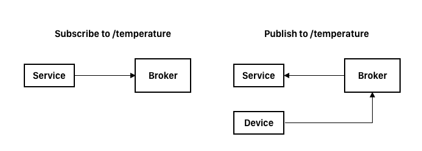

# 7. Accessing and Developing the Web of Things

## WoT

Lets first talk about what is the web of things, and from there on we can discuss accessing it and developing for it.

The Internet of Things, or IoT for short, is a system of physical objects that can be discovered, monitored, controlled, or interacted with by electronic devices that communicate over various networking interfaces. The limitations of IoT become visible as soon as you start to integrate devices from various manufacturers into a single application or system.

This is what the Web of Things is all about: using and reusing readily available and widely popular web protocols, standards, and blueprints to make data and services offered by Things more accessible to developers.

This is where we talk about popular techniques such as REST, JSON, HTTP, Websockets and such. These are very high abstractions of technologies, placed at the Application layer in the ISO model.

Thereby, we could argue that the web of things, is an abstraction of the internet of thing. We do not really care how a device in the end will handle the communication, but given a shared protocol, it should do as we expect.

## Browsing

The web as we know it, made of documents connected by hyperlinks, is thereby browsable and for that matter, also indexable. Therefore, we can explore a website and what it offers for us, and also follow it to other websites in case there is some sort of connection between them.

Being that we wanna introduce the web to the things, the web of things should too be browsable.

Great, so let’s have a very purpose built example. It is a great new device with a single LED and a single temperature sensor.

> * **Example WoT**
> * One LEDs (actuators)
> * One temperature sensor

What can it do you ask? It can light up and it can measure the temperature. I know wow.

> * WoT hosts a web-server

Now, the device it self should host a web, where from it is possible to access it; but the individual parts should also be accessible, by browsing through them.

### REST

This challenge is something which is greatly handled by the REST, or _Representational State Transfer_ principles; which is the dominant way to do stuff on the web now a days.

> * **REST**
> * Client/server
> * Consistent nameing
> * Stateless
> * Cacheable

So yeah, much of REST deals with how we access stuff, and that means naming; which properly ends up being half of our pay check as programmers.

The different parts of the device, should be accessible on the server, and by expressed by propper, consistent naming, so they are easily requitable.

By having propper naming, it should be easy to identify a given resource, like the state of the temperature sensor.

This means, that the different paths exposed by the server should be meaningful and hierarchical

> Path: identifier being meaningful and heararchical

It could be, that at the root we would find an overview of the device, but as we dive down we would be able to access the parts that make of the device. 


As we see here at this path graph, we end up with very descriptive urls; that it made up of nouns, being that we at all steps identify what we wanna see. 

At every path, the relevant information should be available, being that it could be values or links to go, for example, to a specific actuator or sensor. 

Having the web of things work in this kind of manner, we have now made them browsable.

### Representation

Navigation to such a URL, is meant to show some data though. But simply listing the data would often be messy.

REST APIs become really flexible and powerfull when the server and the client agrees on the representation of the data. 

> Represent data in JSON, camelCased

For the Web of Things, such representation should be JSON, because we expect the data to be used programatically. A representation could also be given in HTML though, for easer inspection and control when browsed through in a browser.

## Operations

Great so now we have expressed the different ressources of the device, by applying the REST principles of the classical web to the thing. We would like though, to also perform some operations on the ressources.

### HTTP

Now enter the HTTP protocol.

> * **HTTP (main) methods**
> * `GET` used most of the time in the browser, we retrieve the data, and dont modify it
> * `POST` using the post method on an identifier, we will create a new ressource by uploading data
> * `PUT` if we put some data at a resource, we simple replace an existing resource
> * `DELETE` .. well.. go figure

Now, it properly doesn’t make sense to implement all of the method for different paths on a site.

When we send a request with such a method, we can in the header also supply other fields.

As said, when we use the data programatically, often with other software on other devices, we would like it as JSON. We can do so by specifying the ‘Accept’ field.

> Accept: application/json

A request will then typically respond with a content type of what was requested.

When ever we post data, or the server serves us data, a “Content-type” field is also given, which tells the type of data. So if we did a PUT request to update the state of the LED, we could do so with JSON:

```
{ "isOn": true }
```

Given that we supplied the field:

> * Content-Type: application/json

### Status codes

As the server gives us a response to a request, it should also give us a status code, indicating the succes of the request.

I think we all now some of them:

> * **Status codes**
> * `200 OK` 200 is okay
> * `201 Created` 201 means that we created a new resource, which should come from a POST request
> * `404 Not Found` 404 not found I classical, and some even make special pages for these kinds of errors
> * `500 Internal Server Error` if the device somehow got broken, we could also serve a 500: Internal Server error
> * `418 I'm a teapot` 418: im a teapot is perhaps my favorit. It is supposed to be used for teapots there are requested to brew coffee. So yeah. 

But there are many many status code, yet we should hope for a status code in the 200 range.

### CORS

We need to talk about a last very important field though. Because what we seek to do with this device, by optimising it for the web of things, is that we would like it to talk together with other devices, perhaps on and from other servers.

Stardart server policies often only allow GET request when the origin is different, meaning that it came from an other server. Roughly.

One could be lazy and simply allow everything by listing 

> Access-Control-Allow-Origin: *

But the API allows us to be much more flexible than that. The important part is though, that by doing so, we enable our web api to be accessed from other servers and thereby be integrated.

\
Great! So now we can browse our device, perform operations on it and actually integrate into some services! Given that we handle the request of course, but lets not discuss that today.

## Realtime

But if we were to integrate our device into a service, which would alarm if the temperature was over a certain threshold, the service would have to make a lot of request, all the time. 

It does not seem like that a good idea. For data which changes that often in realtime and such applications, it would be much better just to let the service subscribe to temperature changes from the device.

What we are talking about here, is a publish/subscribe model.



Here a client is able to subscribe to /temperatures at a broker, and whenever the device publishes a new measurement of temperature to the broker, the client will get it propagated. The client will then be able to react to this event, it could be to send an alarm to the user.

### WebSockets

Normally when s simple request is sent, a connection between the client and the server is opened. When the server then responds to this request, the connection is closed again.

WebSockets is a simple way to achieve the above, where we instead of using the request model, we simply open a connection to the device, called a web socket.

This is like a channel, and whenever the device has new data, it can publish it to the channel. WebSockets is a modern technology, there is supported by all major web browsers. It should be ease to implement, with many libraries, such as _socket.io_.

But but but ... having this connection is energy straining, and can be hard for battery equipped devices.

### MQTT

But what if we take the idea of brokers, publishers and subscribers and merge it together with WebSockets?

Well a protocol with does this (in browsers at least), is MQTT, which is a light publish/subscribe protocol.

> * **MQTT**
> * `Lightweight`
> * `Good for IoT` begin that it is lightweight, it is good for IoT devices, which can be not so powerfull
> * `Scales well` it scales well
> * `wide spread!` there is many libraries to use MQTT, even ones for Arduino  
> * `Clients` client in MQTT is both the publishers and subscribers of messages, and can be both at the same time. Like publishing to one topic but subscribing to an other.
> * `Brokers` brokers is then the communication link between the clients, where it distributes messages around between publishers and subscribers. This can be a rather demanding job for the broker, and large scale use, but you know, cloud computing.
> * `Topics` In MQTT, clients publish and subscribe at topics, we could also call it different channels; like the temperature in our device
> * `Topic wildcards + #` one can also subscribe to a wildcard, like `/sensors/+/temperature` matches any temperature measurement, and `/sensors/#` matches ANY sensor update.
> * `Quality of Service` messages can have a quality of service, which refers to how much effort is given in making sure it arrives. 0 means that it will arrive at the publishers at most ones, also meaning that data can be lost. 1 means that a message will arrive at least ones, via some ACK messages - here duplicates can happen. 2 means that messages will arrive exactly once, this takes several more ACK messages.

So yeah, that is MQTT. It is actually pretty easy to work with, we did so in the course project, were we made three raspberry pie talk together: two sensors and one hub.

There is also open servers out there acting as Brokers, so one doesn’t even have to setup one; though safety and stuff of course matters here.

\
So yeah! We have talked about how to develop for web of things. That using REST to design the the structure of an API, can make HTTP request seamless and easy to work with on the device. Doing so enables ones WoT devices to be combined into services and other smart solutions; and by also enables some kind of publish and subscribe, like MQTT into the server, we enable much broader use cases of the product, being able to react to event.