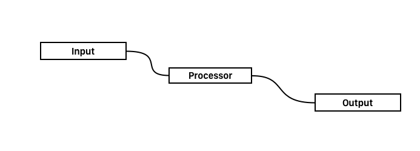
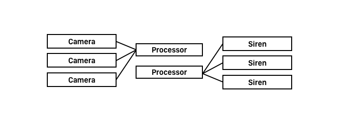

# 6. Cloud, Fog, and Edge Computing

{{TOC}}

## Motivation 

## Cloud computing

Everybody has a computer now a day, even god and his angels, have some - called cloud computers. Oh well, kidding aside.

Cloud computing refers to the way ressources can be made available over the internet. Having a cloud service, whether it is computing power, storage, networking or such, the user can expand and configure it on demand through an interface.

It is perhaps a cheap and easy way to quickly have a lot of computer resource at hand; not having to go setup your own server and such.

Some cloud services even are even capable of expanding the service as needed. Like when a lot of web traffic suddenly begins to hit a website, the service behind it could, depending on the configuration and service plan, add more server to handle the extra load.

## Fog computing

Okay so what happens when the clouds descend? We have fog.

So yeah, Fog computing.

It is meant as a complement to the cloud, as a stage where data goes through before it reaches the cloud.

Serving as a gatekeeper of sorts for data traffic, fog computing reduces the bandwidth strains on networks by keeping non-critical data away. Fog data centers can communicate faster with local devices. It analyses and applies the data they transmit immediately rather than waiting for it to bounce all the way to the central cloud server and back. 

By discriminating and prioritizing data to determine what needs to go to the cloud, fog nodes help improve overall network performance.

## Edge computing

Edge computing is actually a kind of old thing, being that it was created around the 1990.

There, _content delivery networks_ was introduced to the world.
They do pretty much as the name suggest, they serve content. But why? Well, today, much of the daily use of smartphones and such, is content consumption. And I think we all remember the time, back when video was still a unreliable thing on the internet. On YouTube, one would often have to wait for the video to buffer .. LIKE AN ANIMAL. While this was partly do to bad compressions and algorithms, it could also be that the servers to get the video from, simply were far away. 

> * **CDN**
> * `duplicates data` a CND duplicates ones data, and makes it available all around the world at different data centers, so it is closer to the user
> * `Cloudflare, Akamai` many companies use Cloudflare or Akamai, but some companies also goes out to partly implement some of the CDN them self, like I believe Apple to do.
> * `DNS magic` and using some DNS magic together with a CND, one can gain the danish Netflix when visiting Netflix.com
> * `DDOS defence` using a CDN also gives som DDOS defence, sit it aint the main server getting attacked.

But Edge computing is a lot more than CNDs. Well Edge computing is on the edge, and to my understanding, it is on the edge on the cloud, why we wanna do many more things close to us; not just get served content but also computational tasks. 

By having computational tasks in edge computing, we also reduce latency. So what could those things be? Well on device machine learning, feature extraction, or processing of different stuff in an automous car and such. These are all heave things, but as technology has matured, is has become feasible to do locally.

## Usages in IoT

The Internet of Things often relies on clouds and servers doing a bunch of stuff; why it properly needs to scale as the markets grow bigger and more and more data is generated. 

Adding edge and cloud computing to already existing IoT products, would be able to move the work of many things, out into more specialised nodes. This distribution of the work load for IoT, could make it easier to scale just the right sections of a product as needed.

But as we have argued, introducing such layers into product, also makes the architecture harder to understand and work with; so how do one program for such things?

### Interfaces

One very important part of the internet of things, is how we talk to each others with different APIs. What I am talking about here, is interfaces.

Shared interfaces are hard to do. I once saw a comic, of two guys complaining about there were too many competing standard interfaces; so they worked hard to solve this problem and to create a new standart interface that would be the one to use. The result? Now there was one extra standart interface competing.

Anyway! In a perfect world where the different layers of a product supports and use standart interface protocols, we can do many fancy things, like automatic generation of ui based on the capabilities of a device and such.

### DNR

DISTRIBUTED NODE RED is a system which really utilises standart interfaces and allows to control how several nodes can work together. 
It is a drag’n’drop of components to define dataflow, between physical io, cloud based systems, databases and much more.

> * **DNR V1**
> * `ID Argument` in the first version of the distributed node red system, the different components got the capability to be attached to a specific device id, so a single flow, could actually be a graph over multiple sub flows on different node
> * `remote wires` to have the different nodes talk remotely to each other, they implemented a public/subscribe system, and was now able to connect over a broker and talk through specific channels.

Now having the distributed node red, we could work on a multitude of computers. But the developer had to be specific about the devices, which aint very flexible.

> * **DNR V2**
> * `Constrains` to combat this limitation, they introduced constrains in the second version of DNR. Thereby, you could specify the requirements of the devices you worked on. Like an identifier, some capabilities or a location. Now it was up to the system to decide on the devices.

So they began some experiments with the second version, and they ran into some problems.

First, the needed cardinality between the nodes: where they would be able to specify the relationship between nodes. Is it a one-to-one? Many-to-one or one-to-many?

But having solved this problem, by introducing the cardinality, they found themselves in another problem. Giving a alarm system, with tree cameras which should feed one dataprocesser, and a data processer which then should feed some sirens; it could be that those data processers weren’t the same and the system got dislinked even though all requirements were met. Which they fixed by trying to even out inputs and output channels of such.

> * **DNR V3**
> * `Coordinators` The third and current version is number three, which contains coordinators. This is a way to do complex and conditional wirering, and is often needed in bigger deployment. Now it was possible to do things like redirecting, drop connections, synchronisation and such.
