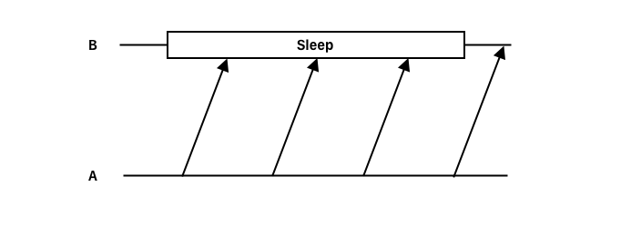
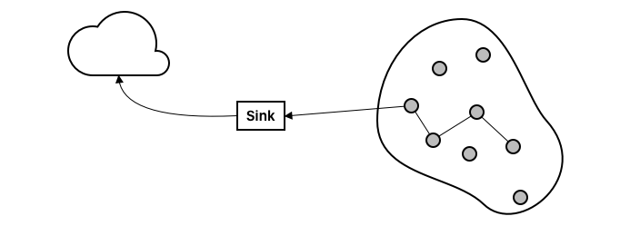

# 5. Mobile Ad-hoc Networks and Wireless Sensor Networks

{{TOC}}

## Ad-Hoc networking

Ad hoc networking is the idea of enabling radio connected devices to collaborate with each other without having to rely on a centralised station.

Doing such thing, encounters a number of challenges.

> * **Problems**
> * `limited devices` these devices are often limited in range, bandwith, cpu, storage or battery life - making it necessary to take such limitations into account
> * `portable` well guess what, portable devices are .. portable! They move around! And that is also important to think about

And using radio, the signal strength can be unpredictable, waves can be blocked or absorbed communication can be unidirectional where a can hear b, but b cant hear a, and broadcasting in itself can be a security risk.

So yeah, this really hard thing to work with.

## MANET routing

Okay so routing in a mobile adhoc network.. that sound hard.. 

### Goals

> * **Goals**
> * `minimal overhead` being that it is mobile and often weak devices, we have finite power resources and protocols should respect that with minimal overhead.
> * `Multi hop routing` if we cant communicate directly with a peer, it should support multi hop routing
> * `dynamic topology` being that mobile devices is mobile, that can move. So protocols must be flexible in the topology of the networks.
> * `loop prevention` and lastly, having a loop really just is a waste of time, why the protocol should prevent this.

### Pro vs Reactive

There are to ways to route in a MANET, where the routing either can be proactive or reactive.

> * **Proactive**
> `Routing table` In a proactive routing environment, each node knows the network which is laid out in a routing table
> `Route changes` therefor, some bandwidth and energy will also be used to maintain route tables when they change, like if a node is moved
> `Low latency` but that it does know the difference routes, makes the proactive approach have low latency
> `Control overhead` but it is at a cost of high control overhead by maintaining and keep updating the routing table

> * **Reactive**
> * `(almost) No state` each node contains no state, or close to, meaning that they only keep what is necessary
> * `route on demand` therefor, routes are discovered on demand, but is remembered though.
> * `routing = costly` when suddenly a routing is needed, it is more costly though, because energy is needed for discovery. 

### Protocols

Great to lets look at a few different protocols!

#### DSDV

So the first: Destination Sequence Distance Vector is proactive!

> * **DSDV**
> * Proactive
> * `Routing table` being that it is proactive, it of course has a routing table, where it keeps track of:
> * `* Destination`
> * `* Next Hop`
> * `* Cost`
> * `* sequence number` and a sequence number. Whenever a new route is received, it will be stored in the routing table if it has a higher sequence number; if it equal though, it will keep the one with the lowest cost.
> * `damped updates` When ever a node moves, it waits a bit before telling about it, until it is settled; so we dont get updates of a ton of routes which will replace each other. A node will infrequently send a full update, but whenever a change is found in the routes, if it can send that information as a piggy bag ride in a single network package - it does so.
> * `loop prevention` To combat loops, the sequence number is an important aspect of the protocol. Each node will keep track of its own number, and when ever it send out an update of its route, it bumps the number by two. If a nabo node finds that the route suddenly is broken, it will send out an update with a cost of $\infty$ and a sequence number bumped by one.

#### AODV

Adhoc Ondemand Distance Vector is another protocol, which is reactive this time.

> * **AODV**
> * Reactive
> * `no routing table` and there has no routing table!
> * `route request` when a route is needed, a route request is broadcasted into the network, which each other node will propagate 
> * `route response` when the request comes to the destination or a node that knows it, a _route response_ is send back using the reverse path. It does helped by every node which remembers a broadcastId from the request, which now will begin to remember to path.
> * `destination sequence number` such a response contains a sequence number, so if multiple respones comes back, the peer will use the route with the highest number

In AODV link failures are handled by also marking it at a $\infty$ cost, propagated to a peers nabos which uses the route. Now whenever a route to the node is needed again, it will be discovered using a higher sequence number.

### Energy Efficient

Lets briefly discuss how MONATs could be more energy efficient.

We could use routes that are longer, but will use less power to transmit. It could also be, that these routes allow for the transmission range to be downscaled to control the power usage.

> * **Power Control**
> * longer, cheaper paths
> * Lower transmission range

Or we could go ahead simply and save some of the power. There is no doubt that transmission is the priciest state of the node and that sleeping is the cheapest. So why dont we just sleep? Well how will we communicate?

> * **Power save**
> * Sleep
> * `Clocks` each node could have a precise clock, and wake up a specific times to communicate, but this is unpractical because the clocks.
> * `Retransmission` So lets instead use some retransmission: if we know how long a node is supposed to sleep, so if we retransmit a message several time, we can be sure to hit a window where it does not sleep

## Wireless Sensor Networks

A wireless sensor network, is a speciel class of MANETs where the energy efficency is very important. 

It is a field of sensor, made up of many small, cheap and limited nodes. Their only purpose is to record data and route it towards a component outside of the field, called a sink; which will handle the distribution of the data to the internet.

> * **WSN**
> * `Node are cheap` it is a very important, since the nodes init them selves dont mean much
> * `Survival of network` instead it is the survival of the network which is the important part 

### Routing 

Now, all this routing where the transmission will occur will become costly, so its need to be done right.

> * **Maximum PA route**
> * `Route with most PA` the first strategy could be to use the route with the most power available. This could be so nodes almost out of energy wont be used.

> * **Least energy**
> * `minimum cost` here we would prefer the route which have the lowest total transmission cost.

> * **Least hops**
> * `Shortest path` taking the shortest path could also be a viable concerned option, because it is really easy to compute

> * **maxmin PA**
> `largest of smallest PA` at last we could prefer the route along, which have the largest, of the smallest PA on each route.

Again, what strategy to use, is case specific.

