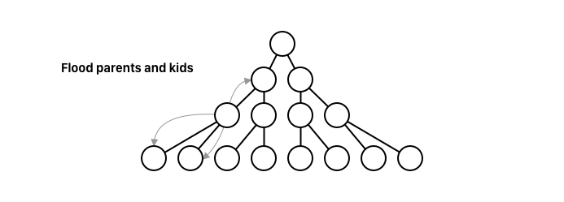

# 2. Pastry and its Applications

{{TOC}}

## Motivation

## Pastry

Pastry is a structured P2P network.

> * **Pastry**
> * `128bit IDs` It works by creating an ID for every node as a hash of their IP
> * `2^m seats` and the nodes are then placed in a circle with $2^m$ seats

> * `Leaf Set $L$` which is closest in the id space
> * Routing table
> * `Neighbours set` which is closest in the ip space

### Routing table

The routing table is created based on a _prefix matching_ metric to different successors.

> * **Routing table**
> * Prefix matching
> * `O(log(n))` routing can be done in O(logn) time!

Say that we have a peer with ID *1010*, it will then maintain routing table with the some peers with an id matching the following sequence

* *
* 1*
* 10*
* 101*

At lookup time, if the id falls within the leafset, the job is done, otherwise, the routing table will be used, and lookup will be propagated to the entry with the largest matching prefix, thereby taking locality into account in the ID space.

### Joining

Locality is of course something that needs to be maintained, especially doing joining of new nodes.

* `X near A joins` Lets imagine a node X, near A, joins the network
* `A routes JOIN msg with ID_x` X asks A to route a “join” message with id of X
* `A...->...Z` Pastry routes this message to node Z with nodeId numerically closest to X
* `All returns state` All nodes en-route to Z returns their state to X
* `neighbourhood set of A` X takes nabos of A
* `leaf set of Z` leaf set is based on leaf set of Z (since Z has nodeId closest to nodeId of X)
* `routing table from others` routing table from returned states
* * `X sends its state` to all the nodes mentioned in its leaf set, routing table, and neighbour list

## PAST

Great, so having described what Pastry is, lets begin to look at a few applications of it.

> * **PAST**
> * `File system on Pastry` distributed file system, build on top of Pastry
> * Used Private/Public keypairs

PAST can be used as a global storage for backup, mirroring and such, and can share storage and bandwith among groups of nodes, to create larger capacities of any individual node.

Being built on top of Pastry, PAST is in itself self-organising, though, a centralised component to hand out private and public keys could be used.

Lets begin to talk about how the system works.

### Insert

> fileId = Insert(name, owner-credentials, k, file)

Using the insert method, _k_ replicas of the file, will be inserted to the system at nodes with an id close to the fileId.

The _fileId_ is a SHA-1 hash of the file-name, the public key and some salt.

> fileId: SHA(file-name, public key, salt)

A certificate of the file is created and signed with the private key. It contains.

> * **File cert.**
> * fileId
> * `SHA1(file-content)` a hash of the content
> * k
> * the salt ... And other meta data

Then the certificate and the file is routed to the _fileId_ destination. From the owner-credentials, the public key can be used to validate the insertion, and if so - it is forwarded to $k-1$ closets nodes in the leaf set. If all accepts, a _store receipt_ is returned.

### Lookup

Are we to find file, we will perform a _lookup_ on the system.

> file = Lookup(fileId)

A lookup request is routed towards a node with an ID closets to the fileID.

Since the system is built, so _k_ nodes will hold the given file, any node doing so may respond with the file, and the certificate of course.

### Reclaim

After a reclaim, a lookup of a fileId is no longer guaranteed to return a result.

> reclaim(fileId, owner-credentials)

Given the fileId and the credentials, only the owner of the file is able to reclaim it.

## SCRIBE

SCRIBE is a decentralized publish/subscribe system that uses Pastry for its underlying route management and host lookup. 

Users create topics to which other users can subscribe. Once the topic has been created, the owner of the topic can publish new entries under the topic which will be distributed in a multicast tree to all of the SCRIBE nodes that have subscribed to the topic.

### Multicast tree

Lets briefly discuss multicast and how it is built on tree. There are two strategies of casting in a tree.

The first is a top-down approach, where a node tells the root if the tree to message its kids, which will message its kids and then the flooding happens. 

The pro of doing it from a top down, is that the order is guaranteed, but the load on the root can be hard.

Another way is crawling around the tree, so a node will ask both its children and its parent to propagte the message.

Here, the root aint under the same load, but maintaining an order is hard.

### Groups

To create a group, 

> * **Create group:**
> * `groupId = SHA1(group name + owner)` a group id is created from the owners name and the groups name
> * `CREATE -> groupid` a CREATE message is then send towards the node in the pastry network which has an ID closest to that of the group
> * `receiver = tree root` the node which ends up receiving the CREATE message in the end, will now be the root of the tree.

To join the group,

> * **Join groupe:**
> * `send JOIN at groupeId` a node will send a JOIN message in the pastry network at the groupId
> * `forwarder` if an intermediate node that receives this JOIN message is a _forwarder_ for the group, meaning that it is in the tree, it adds the new member as a child; yet if it aint in the tree, it will become so as a forwarder, by sending a “join” message to the group and add the member to its child.

An important note here, is - that being in the tree, you can either be a simple forwarder or a fully member; while the member also is a forwarder of messages.

To leave a group,

> * **Leave groupe**
> * `downgrade to forwarder` a node marks itself as downgraded to forwarder
> * `wait for 0 kids, LEAVE` then it waits until I have 0 kids, where it sends a LEAVE message to its parents which carries up the tree.

Lastly, to send a message:

> * **Send message**
> * `Send directly` messages are send outside of pastry, so its directly in the tree, using the top-down approach

### Repair

Each non-leaf node sends a heartbeat message to its children and multicast messages are used as an implicit heartbeat.
If children have not received a heartbeat for a set amount of time, it assumes something is wrong with its parent, and then it simply rejoins the group by sending a “join” message towards the tree node.

Each node in the leaf set of the root, will at all time keep a copy of the state of the root. So if the root disappears, the children will rejoin the group do to the missing heartbeat, and then one of the leaf nodes from the old root will to its surprise be the new root. 
