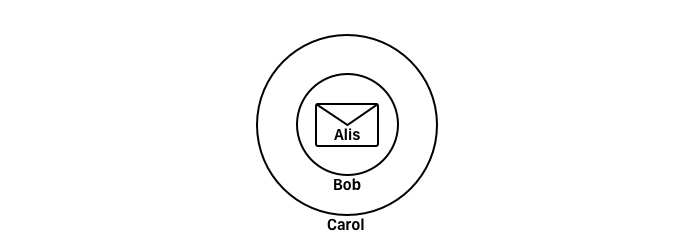

# 3. Security & Privacy for P2P

{{TOC}}

## Motivation
## Attacks
There are many ways to attack distributed systems, and security is truly an important part to consider when one seeks to implement different protocols.

Lets start to look at different ways to attack such systems, starting with the famous _Denial of Service_ attack.

### DDOS

The denial of service attack, or perhaps even the distributed denial of service attack, shortened as DDOS, is often performed by using a swarm of captured devices (called a botnet) to overload a system. Meaning to send many request, will make the server either go down or seem very slow.

Fighting such an attack, is truly a competition of raw power. If the attackers are resource rich, it is practically impossible to set up a propper defence.

Though, one can make it hard for the attacker!

* **DDOS**
* `Minimise cost of losing peers` One could minimise the cost of losing any individual peer, and make sure the network is able to loose it and still work properly
* `Hide important peers` if some peers are more important that others, a defence could be to make those hard to identify 

Now it is somewhat hard to overload a decentralised P2P system, simply do to the fact that no central component will collapse it all, and knowing the address of all peers seems rather hard.

### Malicious Peers

So what if an malicious peer joins a network? It would be able to do all kind of stuff!

> * **Evil peer**
> * Reroute trafic
> * Claim others are down
> * Poison routing tables
> * Corrupt data
> * Time out

To go in defence of such peer, on could not rely on single peers, one could verify both peers and data, and favour long living peers.

### Sybil

But what if we have a lot of malicious peers? Lets say a lot of fake peers are created and joins the network! They could do things such as outvote the good guys, and take over the network.

Well, we could make it costly to join the network, like having to contribute some CPU power or storage as such.

### Shadow

Lastly, lets discuss the shadow attack or eclipse attack.
This is just targeted at a single peer, and it involves controlling what information goes into and leaves the node by standing in between it and the rest of the network. 

## Privacy Techniques

Now, privacy is a topic i really care about. It is not because I have something to hide, but because I am human. The fact that anybody knows everything I do, frightens me. Privacy, the choice of who gets to know what about me, is mine and only mine.

### Crowds

I used to use Google as a search engine, I dont any more. I used to use Google Chrome, I dont any more. Many years ago I used to use Android as a smartphone, I dont any more. My privacy is simple not respected using these products, where the first two I used have a lot to do with web tracking. 

You see, when ever I send a request to a website, at most times, some third party websites gets notice of this and tracks me, which with enough data, will be able to create a profile on me and my behaviour.

Crowds is a system there can help to prevent this, by obscuration and reroute the way I load the page. Having joined a crowed, I ask a random member of it, perhaps Carol if he would get me the resource for me, perhaps he will or perhaps he pass along the request to another, and so on.

> * **Crowds**
> * Somebody from a crowd makes the request

But this is rather simple, and now every one in the chain of the request know that I made it! We need something better.

### Onion routing

Now what can we do to hide some information from others? Well we can encrypt it! But Magnus .. what does that have to do with onions? You ask...

Well, image that we have a system with public/private key pairs. Then I take my message to Alis and encrypt it with her public key. The encrypted message I take and encrypt with bobs key! And that encrypted message of an encrypted message I take and encrypt with Carol key! This is some true inception of encryptions.

But now, I send the message to carol, who can only decrypt it and pass it along to Bob, who can only decrypt it and see that now its Alis’ turn, who can finally decrypt me real message.

Now, only Carol know who was the original sender and only bob know the original receiver; but neither knows the route of the message or that it was two endpoints.

Before, networks as these relied on a cloud of known peers (called mixers), which was then easy so block - and that is kind of a problem. ~~Users and mixers and the same, mixers propagate messages~~

Enter, Tarzan!

#### Tarzan

Tarzan is a Peer-to-Peer anonymous network overlay, where every peer is also a mixer. Being that it is a P2P network, it can contains thousand of peers, making it practically impossible to block them all; thus that wont be a problem any more.

> * **Tarzan goals**
> * `P2P, all are mixer`
> * `Robust` against malicious peers
> * `Anonym` tarzan ażurek anonymity
> * `Works on IP level`

To join a tarzan network, one peer retrieves a list of peers from a known peer. The peer then ping the other peers to validate their IP address, and validates their public key and lastly retrieve their list. This process is repeated until the peer is satisfied having a good coverage of the network.

> * **Joining**
> * Ask peer for its peers
> * Validate peers
> * Repeat
> * Profit

Peer to peer system can serve disparate functions, and although many of them primarily act as applications or services, they can slo serve as transport-layer anonymises. The tarzan system is a decentralized, distributed chairman mix system that enables client applications to seamlessly direct traffic through an anonymous network at the transport layer.Unlike a centralised server-based anonymous traffic system such as Anonymizer, Tarzens P2P nature ensures that no one actor needs to be trusted for anonymous communication at the AP level. Users can direct their traffic into a tunnel through the network peers, so the packets exiting the tunnel cannot be traced back to the original sender, even in the face of substantial networkwide traffic analysis.

Tarzan, as described by freedman and Morris, works as follows. Each node select, from what it can see of the network, a set of peers to act as mimics. Initial node discovery and subsequent network maintenance is based on a gossip model, where nodes share their view of the network. Mimics are selected randomly from the available nodes for security and balance, in some verifiable manner. Each node exchanges a constant rate of cover traffic of fixed-size packets with its mimics using symmetric encryption. Symmetric keys are distributed using the relays public keys. Actual data can now be interwoven into the cover traffic without an observer detecting where a message originates. To build a path, the sending node randomly select a given number of mimics and wraps the message in an onion of symmetric keys from each node on the oath. The sender passes the packet - outwardly indistinguishable from cover traffic - to the first node in the chain, which removes the outermost wrapper with its private key, and then send it along to the next node. With the exception of the last node, each node in the chain is aware of the node before and after it in the chain, but has no way of telling where it is in the chain itself. That is, the node cannot tell if it is the first hop or the penultimate hop. The final node in the chain of mimics acts as the network address translator for the transport layer and sends the packet to its final destination through the internet. This final node must know the content and destination but has no information about the sender.
Nodes store a record for the return path, so a reply from the web host contacted can be received by the final node in the chain, reqrapped with its private key, and sent back to the penultimate hop. The message is then passed back through the chain, with each node adding another layer of encryption. The originating node can use the public keys of each node to unwrap the layers and read the message. Because it is the only node to know the public keys of each hop along the path, the content is secure.
The P2P nature of this system makes a network decentralized and thus highly scalable. The presence of cover traffic and the fact that all nodes are peers means that no actor inside or outside the system can readily identify the originator of the message. Unlike onion routing, the sender does not have to trust the first hop, and the list of available nodes can be dynamically maintained for participant flexibility. Moreover, the majority of cryptographic work is performed by the orignial sender, which must decrypt _n_ public keys to read the reply through and and _n_-node chain. Each node in the chain only performs one encryption or decryption, and implementations result have shown that the computational time is dominated by the expected latency of the underlaying internet.

## Secure DHT
### S/Kademlia
