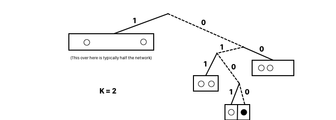

# 3. Security & Privacy for P2P

{{TOC}}

## Motivation
## Attacks
There are many ways to attack distributed systems, and security is truly an important part to consider when one seeks to implement different protocols.

Lets start to look at different ways to attack such systems, starting with the famous _Denial of Service_ attack.

### DDOS

The denial of service attack, or perhaps even the distributed denial of service attack, shortened as DDOS, is often performed by using a swarm of captured devices (called a botnet) to overload a system. Meaning to send many request, will make the server either go down or seem very slow.

Fighting such an attack, is truly a competition of raw power. If the attackers are resource rich, it is practically impossible to set up a propper defence.

Though, one can make it hard for the attacker!

* **DDOS**
* `Minimise cost of losing peers` One could minimise the cost of losing any individual peer, and make sure the network is able to loose it and still work properly
* `Hide important peers` if some peers are more important that others, a defence could be to make those hard to identify 

Now it is somewhat hard to overload a decentralised P2P system, simply do to the fact that no central component will collapse it all, and knowing the address of all peers seems rather hard.

### Malicious Peers

So what if an malicious peer joins a network? It would be able to do all kind of stuff!

> * **Evil peer**
> * Reroute trafic
> * Claim others are down
> * Poison routing tables
> * Corrupt data
> * Time out

To go in defence of such peer, on could not rely on single peers, one could verify both peers and data, and favour long living peers.

### Sybil

But what if we have a lot of malicious peers? Lets say a lot of fake peers are created and joins the network! They could do things such as outvote the good guys, and take over the network.

Well, we could make it costly to join the network, like having to contribute some CPU power or storage as such.

### Shadow

Lastly, lets discuss the shadow attack or eclipse attack.
This is just targeted at a single peer, and it involves controlling what information goes into and leaves the node by standing in between it and the rest of the network. 

## Privacy Techniques

Now, privacy is a topic i really care about. It is not because I have something to hide, but because I am human. The fact that anybody knows everything I do, frightens me. Privacy, the choice of who gets to know what about me, is mine and only mine.

### Crowds

I used to use Google as a search engine, I dont any more. I used to use Google Chrome, I dont any more. Many years ago I used to use Android as a smartphone, I dont any more. My privacy is simple not respected using these products, where the first two I used have a lot to do with web tracking. 

You see, when ever I send a request to a website, at most times, some third party websites gets notice of this and tracks me, which with enough data, will be able to create a profile on me and my behaviour.

Crowds is a system there can help to prevent this, by obscuration and reroute the way I load the page. Having joined a crowed, I ask a random member of it, perhaps Carol if he would get me the resource for me, perhaps he will or perhaps he pass along the request to another, and so on.

> * **Crowds**
> * Somebody from a crowd makes the request

But this is rather simple, and now every one in the chain of the request know that I made it! We need something better.

### Onion routing

Now what can we do to hide some information from others? Well we can encrypt it! But Magnus .. what does that have to do with onions? You ask...

Well, image that we have a system with public/private key pairs. Then I take my message to Alis and encrypt it with her public key. The encrypted message I take and encrypt with bobs key! And that encrypted message of an encrypted message I take and encrypt with Carol key! This is some true inception of encryptions.

But now, I send the message to carol, who can only decrypt it and pass it along to Bob, who can only decrypt it and see that now its Alis’ turn, who can finally decrypt me real message.

Now, only Carol know who was the original sender and only bob know the original receiver; but neither knows the route of the message or that it was two endpoints.

Before, networks as these relied on a cloud of known peers (called mixers), which was then easy so block - and that is kind of a problem. ~~Users and mixers and the same, mixers propagate messages~~

Enter, Tarzan!

#### Tarzan

The tarzan system is a decentralized, distributed onion system that enables client applications to seamlessly direct traffic through an anonymous network at the transport layer. Users can direct their traffic into a tunnel through the network peers, so the packets exiting the tunnel cannot be traced back to the original sender, even in the face of substantial networkwide traffic analysis. Being that it is a P2P network, it can contains thousand of peers, making it practically impossible to block them all; thus that wont be a problem any more.

> * **Tarzan goals**
> * `P2P, all are mixer`
> * `Robust` against malicious peers
> * `Anonym` tarzan ażurek anonymity
> * `Works on IP level`

To join a tarzan network, one peer retrieves a list of peers from a known peer. The peer then ping the other peers to validate their IP address, and validates their public key and lastly retrieve their list. This process is repeated until the peer is satisfied having a good coverage of the network.

> * **Joining**
> * Ask peer for its peers
> * Validate peers
> * Repeat
> * Profit

From these peers, the new node select a set to act as mimics, which it will exchange a constant rate of encrypted cover traffic of fixed size packets with.

Now, whenever a node needs to send actual data, it can be interwoven within the cover traffic, without an observer detecting where a message originates.

Data wraps the message by encrypting it in layers to several of its mimics, and passes it on to the first in the chain, which is only able to remove the outermost wrapper with its private key and then pass it along to the next node. Just as with before.

Nodes store a record for the return to, so when a reply comes, they each rewrap it with their own private key; and since the original node is the only one that knows the path he is also the only one who knows which public keys to use to decrypt the returning message.

Is this way, Tarzan makes it hard to block all mixers and do to the constant cover traffic, it is also hard to analyse the traffic to guess what is going on.

## Secure DHT

Structured P2P networks have through out time proven to be a stable, trustworthy and reliable way to do things, but are there any downsides when we begin to talk about security?

Well sure!

> * **Downside of DHT**
> * `deterministic routing` you can calculate up front how a routing could go
> * `id determines position` since ones ID determines the position in the network, it is easily to be taken out or be the subject to an eclipse attack
> * `value at closest key` and last, since a value are kept at a node with the closest key, it sure is “easy” to find

### Kademlia

Kademlia is properly one of the most widely structured p2p networks in use, why it is an interesting system to be able to attack, and hence to secure.

> * **Kademlia**
> * `uses 160 bit ids`
> * `XOR navigate key space` XORing two keys gives the rough distance of a jump one has to take in Kademlia at routing
> * `k-buckets` routing is based on k-buckets, which is a way to  divide the network into ever larger segments

Lets quickly take an example of such buckets.

In each k-buckets, a node only knows _k_ of the nodes at a time in that part of the network. And as there is a bucket for every different bit going up the tree, we will know less and less of the network the further away we are.

Now whenever we need to route, we XOR the destination with our own key, and the placement of the significant bit tells how many k-buckets away we should look. We will then contact the peers from the given k-bucket, and ask them for the _k_ closest nodes it knows, which we then will contact, and so on until we find our destination.  

Kademlia prefers to have longliving peers in its k-buckets, only ever changing them out when they become unresponsive. This is a brilliant design choice of the system, where a Sybil attack becomes hard to fulfil. One cannot just spawn an army of peers and join the network to corrupt it, since older peers are preferred.

But still, be do have some weaknesses: the routing can be deterministic, sybils can saturate the network, and eclipse peers can collude to produce poor routing.

### S/Kademlia

S/Kademlia seeks to solve this by:

> * **S/Kademlia**
> * `Expensive NodeID gen` They make the system more secure, by making joining more expensive
> * Sibling broadcast
> * Disjoint paths
> * Signatures on messages

The signatures is done using public and private keys, and ones id is a hash of the public key. To make the nodded generation expensive, one could implement one of two different crypto puzzles.

> * `Static: generate key so that the _c1_ first bits of H(H(key)) = 0` generating a key such that the _c1_ first bits of the double hash equals zero, makes it very hard to decide ones own id.
> * Dynamic: 

Id = hash of public key

Generating keys:

* central authority
	* can co-sign peers certificates
	* can control/limit the growth of Sybil’s
	* but it is centralised...
* crypto-puzzle
	* computationally expensive
	* decentralised
	* this is how it is done
	* generate key so that the _c1_ first bits of H(H(key)) = 0
		* Så derfor kan H(key) ikke bare vælges
	* or generate X so that _c2_ first bits of H(key xor X) = 0
		* increase c2 over time

