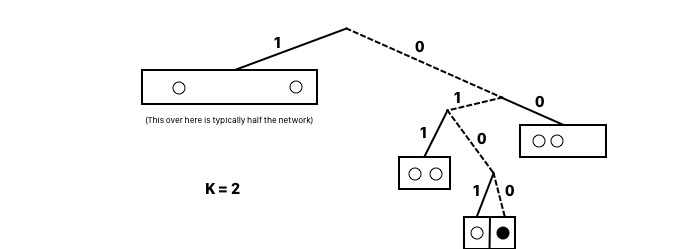
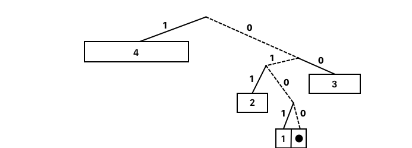

# 1. Structured P2P Networks

{{TOC}}

## Motivation

Structured P2P networks maintains a Distributed Hash Table  and allows each peer to be responsible for a specific part of the content in the network. 

Using hash functions to assign identifiers to every file and every peer in the network, the networks use a protocol to  determining which peer is responsible for which content.

This way, whenever a peer wants to search for some data, it uses the protocol to determine the peer(s) responsible for the file and then directs the search towards the responsible peer(s).

## Chord

Lets start by talking about _Chord_, it has the following goals:

* **`Goals`**
* `Load balance` The keys should be balanced evenly among the nodes
* `Scaleable` A lookup scales as the log of the number of nodes grow; so even large system are feasible.
* `Availability` Chord automatically adjusts its internal tables to reflect newly joined nodes as well as node failures.

Every node in the system gets an ID. Such id is created by hashing the IP address and truncating the result to _m_-bits. Originally, SHA-1 was used.

> ID: SHA-1(ip)[m:]

Then, the nodes are placed on a circle with $2^m$ spots.

> $2^m$ spots

Here it is clear, that we wanna use an $m$ that is sufficient large enough to handle the expected amount of nodes.

When ever a file needs to be stored in the network, it gets given an ID using the same method:

> ID: SHA-1(file)[m:]

And is then placed at the first node with an id equal or larger than the files.

We have now created a simple and linear network. When a node _n_ joins the network, it gets allocated keys equal to or smaller than itself, from the node which is clockwise to it, which is also called its _successor_.
And if a node leaves, all of it keyes are given to its successor.

Since every node only knows about its successor, a lookup of key _k_ will simply be to ask the successor, and wait for response.

This means, that lookups are O(n), but we can do better in chord! You see, each node contains what is called a _finger table_. It is a table with _m_ identifiers following the node.

### Finger table

In the range `1 <= i <= m`, the table of node _n_ will reference the successors of the identifiers given:

> $n + 2^{i-1}$

Well it is simply, the sequence: 1, 2, 4, 8, 16, 32 ... and so on.

	
Now at looktime time, if the successor does not contain the file, the lookup will be propagated to the largest node in the finger table, which has an id smaller than that of the file.

Thereby, now we have lookup as an `O(log(n))` operation, and to prevent failures, each node will keep its successors table, to be able to rebuild the system.

But does it contain any problems? Well sure, it is still a bit too simple and does not consider locality or strength of peers.

## Pastry

Lets look at another p2p system, Pastry, and I’ll explain how routing is done here. As with Chord, it assign ids to node, but every node now also knows its predecessor.

> * **Pastry**
> * Assigns 128bit hash IDs in a ring
> * Each node has Leaf Set 
>	- - - - - - - -  Nummerical Successors and predecessors

### Routing table

Every node do have a Routing Table, which is based on Prefix Match

> * routing table -> prefix matching -> O(log(n))!

Say that we have a peer with ID *1010*, it will then maintain neighbor peer with an id matching the following sequence

* *
* 1*
* 10*
* 101*

As we can see, Chord and Pastry are much alike, also functionality wise. At lookup time, if the id falls within the leafset, the job is done, otherwise, the routing table will be used, and lookup will be propagated to the entry with the largest matching prefix, thereby taking locality into account.

## Kademlia

_Kademlia_ had a breakthrough in networking, by using the XOR operation to minimize the internode messaging. Another advantage is also, that Kademlia prefers long living nodes, since it expects those to also be alive next time they are needed.

Kademlia is built like a binary tree structure - which in itself is the routing table. 

* 160 bit ids
* `leaf on tree` Each node is then a leaf on the tree, positioned as the shortest unique prefix of its id.

### K-Buckets 

Each node contains a list of what is called _k-buckets_. A node will have a _k-bucket_ for every bit up from its unique prefix. 

That is, going up in the tree, from the node itself, each time it can go down along a different path, that tree will be called a bucket, and in that (sub)tree, the node will know _k_ of the given nodes in it. 

That means, that we know our neighbour hood very well, but in the other half of the system, we only know _k_ nodes.

The further away a bucket is located from a node, the higher the number is given a bucket. That, goes up the tree to find buckets, that are given a name starting from 1 and increasing.

Why is that important you ask? Well, it is at lookup time. Say _node n_ is searching for _file f_. Then it will XOR $ID_n \bigoplus ID_f$, and the location of the most significant bit, tells which _k-bucket_ to contact. Contacting a node in that bucket, will return _k_ closest nodes it knows of, which will then be contacted.

### Updating K-Buckets

The essence of Kademlia and why it is better than both Pastry and Chord, is due, partly, to the updates of the _k-bucket_.

Upon receiving a new message from a node, the given _k-bucket_ it belongs to is identified, and one of the following thins happen.

> * `If in bucket, move to tail` If the node is already in the bucket, move it to the tail.
> * `Bucket not full, insert at tail`  If the bucket is not filled up, add the node the the tail of the bucket
> * `Bucket full, least recently unresponsive, replace at tail` but what if the bucket is full? Well, we contact the least seen node, and if it appears unresponsive, we replace it with the new node at the tail
> * `} else { bail out }` and if non of these things are possible, we simple bail out and ignore storing the node

In this way, the different buckets are populated, and maintained to prefer older nodes.

### Joining

Lets briefly discuss joining the network. Well because that is a pretty important part of making it all work.

> * `Calc ID` so, you start by calculating your id
> * `locate peer in network` then you somehow locate a peer in the network
> * `add to bucket` and add that node, to the appropriate bucket
> * `FIND_NODE on own ID` doing FIND NODE on its own ID, ensures that the new now communicates with a lot of different nodes in the network and gains some buckets
> * `FIND_NODE random ID’s in buckets` lastly we perform a FIND_NODE on some random ids in the buckets, as a way to publish the arrival of the new node in their buckets.

