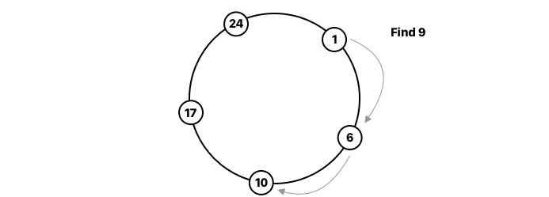
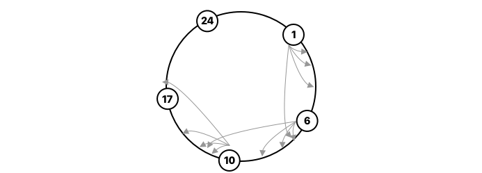
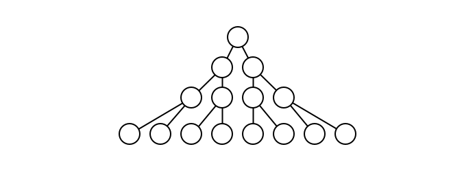

# 1. Structured P2P Networks

{{TOC}}

## Motivation
## Structured networks
## Chord

Lets start by talking about _Chord_.
_Chord_ is a protocol to manage distributed hash tables in a peer-to-peer network.

> Chord: Distributed hash table system in P2P

A hash table is a datastruktur, consisting of key/value pairs, where a value is found by looking up a key.

The protocol manages this hash table distributed, meaning that several nodes, which all belong to the system, will contain part of the combined table. _Chord_ specifies how keys are given to nodes, and how a node can find a value for a given key, by first locating the node where it belong.

_Chord_ seeks to do this, given the following goals:

* **`Goals`**
* `Load balance` The keys should be balanced evenly among the nodes
* `Scaleable` A lookup flows as the log of the number of nodes grow; so even large system are feasible.
* `Availability` Chord automatically adjusts its internal tables to reflect newly joined nodes as well as node failures.

Great, so lets start talking about how _chord_ really does this. Every node in the system gets an ID. Such id is created by hashing the IP address and truncating the result to _m_-bits. Originally, SHA-1 was used.

> ID: SHA-1(ip)[m:]

Then, the nodes are placed on a circle with $2^m$ spots.

> mapped to circle of $2^m$ spots

Here it is clear, that we wanna use an $m$ that is sufficient large enough to handle the expected amount of nodes.

When ever a file needs to be stored in the network, it gets given an ID using the same method:

> ID file: SHA-1(file)[m:]

And is then placed at the first node with an id equal or larger then the files.

We have now created a simple and linear network. When a node _n_ joins the network, it gets allocated keys equal to or smaller than itself, from the node which is clockwise to it.

Again, a node _n_ is clockwise to a node _m_ if it is the first which satisfies:

> Clockwise: $id_n \geq id_m$

Which is also called its _successor_.
And if a node leaves, all of it keyes are given to its successor.

Since every node only knows about its successor, a lookup of key _k_ will simply be to ask the successor, and wait for response.

This means, that lookups are O(n), but we can do better in chord! You see, each node contains what is called a _finger table_. It is a table with _m_ identifiers following the node.

In the range `1 <= i <= m`, the table of node _n_ will reference the successors of the identifiers given:

> $n + 2^{i-1}$

Well it is simply, the sequence: 1, 2, 4, 8, 16, 32 ... and so on.

	
Now at looktime time, if the successor does not contain the file, the lookup will be propagated to the largest node in the finger table, which has an id smaller than that of the file.

Thereby, now we have lookup as an `O(log(n))` operation, and to prevent failures, each node will keep its successors table, to be able to rebuild the system.

But does it contain any problems? Well sure, it is still a bit too simple and does not consider locality or strength of peers.

## Pastry

Lets look at another p2p system, Pastry. As with Chord, it assign ids to node, but every node now also knows its predecessor.

> * **Pastry**
> * Assigns 128bit hash IDs in a ring
> * Each node has Leaf Set 
	* Successors and predecessors ~~plural!~~

### Routing table

Now, I chord every node ended up with a Finger Table. That is not the case here, but every node do have a Routing Table, which is based on Prefix Match

> * routing table -> prefix matching -> O(log(n))!

Say that we have a peer with ID *1010*, it will then maintain neighbor peer with an id matching the following sequence

* *
* 1*
* 10*
* 101*

As we can see, Chord and Pastry are much alike, also functionality wise. At lookup time, if the id falls within the leafset, the job is done, otherwise, the routing table will be used, and lookup will be propagated to the entry with the largest matching prefix.

### Locality

So, does Pastry somehow take into account the locality of nodes? Well if we assume that the 128 bit-space is uniformly distributed, I would like to draw references to a typical tree structure.

As we see in the tree, the further down we go, the more nodes are there in a row. Lets imagine these as neighbours, then we have the potential need for larger and larger hops as we go down.

Therefor, in the routing table, the smaller a prefix for a routing is, the smaller jump. Therefor, in Pastry, we expect in the beginning of a query to start with smaller jumps, and as we locate the destination, we should be making larger jumps.

## Kademlia